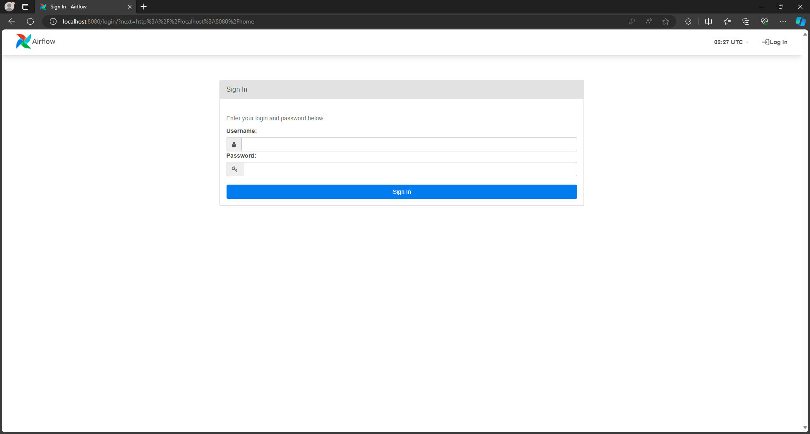
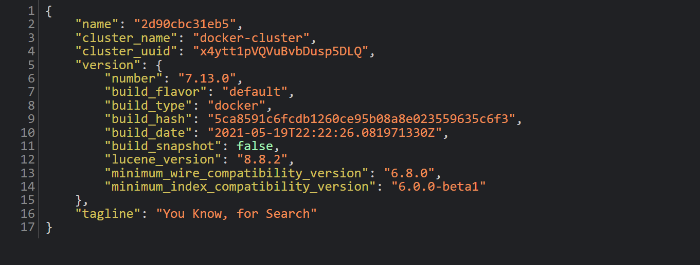
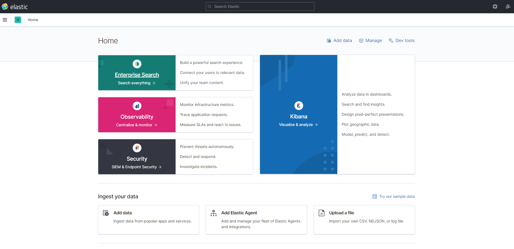

# ETL - Apache Airflow - Kibana Visualization 💫

Proyek ini berisikan visualisasi data dengan menggunakan Kibana melalui elasticsearch. Proyek ini bertujuan untuk melakukan automasi proses ETL dengan menggunakan Apache Airflow, dimana proses ini ada dalam DAG yang berisikan pengambilan data dari PosgreSQL (Extract), data cleaning (Transform) dan load data clean ke elasticsearch untuk divisualisasikan ke Kibana (Load).

## Daftar Isi 🗒️
1. [Link Terkait Project](#link-terkait-project-)
2. [Project Overview](#project-overview-)
3. [Latar Belakang Masalah](#latar-belakang-masalah-)
4. [Metode yang Digunakan](#metode-yang-digunakan-️)
5. [Cara Menggunakan Project Ini](#cara-menggunakan-project-ini-)
6. [File yang Tersedia](#file-yang-tersedia-)
7. [Libraries](#libraries-)
8. [Author](#author-️)

## Link Terkait Project ⛓️‍💥

 - [Dataset](https://www.kaggle.com/datasets/lainguyn123/employee-survey)

## Project Overview 📝

Dalam proyek ini saya menggunakan Apache Airflow melalui docker untuk mengautomasi proses ETL (Extract, Transform, Load) dan menggunakan Kibana sebagai alat visualisasi data. Beberapa langkah utama pada proyek ini adalah:

1. **PostgreSQL**:
- Melakukan proses pengambilan data mentah dari PostgreSQL dengan automasi menggunakan Apache Airflow melalui docker.

2. **Apache Airflow**:
- Proses terjadinya ETL (Extract, Transform, Load) dimana DAG dibuat untuk melakukan 3 proses ini secara otomatis dan data diperbarui setiap minggunya.

3. **ElasticSearch**:
- Mengambil data yang sudah di cleaning untuk dilanjutkan proses visualisasi.

4. **Kibana**:
- Proses visualisasi untuk melihat insight yang bisa didapatkan dari data yang telah di cleaning.

## Latar Belakang Masalah 🧐

Untuk memudahkan proses pengambilan data diperlukan adanya otomatisasi didalamnya, sehingga Project ini dibuat untuk menjalankan perintah menggunakan aplikasi PosgreSQL, Apache Airflow, Elasticsearch dan Kibana dalam prosesnya.

## Metode yang Digunakan 🛠️

- ETL (Extract, Transform, Load)
- Visualisasi Data
- Great Expectation

## Cara Menggunakan Project Ini 💻

1. Clone repositori ini ke dalam lokal Anda:
    ```bash
    git clone https://github.com/adeindrar/ETL-Apache_Airflow-Kibana_Visualization.git
    ```

2. Buat sebuah folder baru di local computer, misalkan **project-ETL**.

3. Copy 2 buah file dari clone repository ini yaitu `.env` dan `airflow_ES.yaml` yang ada di dalam file `aiflow` ke dalam folder baru tadi yang berada di local computer (folder `project-ETL`) sehingga struktur folder `project-ETL` akan menjadi
   ```
   project-ETL
   |
   ├── .env
   ├── airflow_ES.yaml
   ```

4. Perhatikan bagian `x-common` pada Docker Compose.
   ```
   x-common:
     &common
     image: apache/airflow:2.3.4
     user: "${AIRFLOW_UID:-50000}:0"
     env_file: 
       - .env
     volumes:
       - ./dags:/opt/airflow/dags
       - ./logs:/opt/airflow/logs
       - ./plugins:/opt/airflow/plugins
       - /var/run/docker.sock:/var/run/docker.sock
   ```

   Terlihat bahwa docker akan melakukan mapping pada folder `dags`, `logs`, dan `plugins`. Oleh karena itu, buat terlebih dahulu 3 folder ini pada folder `project-ETL` sehigga struktur foldernya akan menjadi : 

   ```
   project-ETL
   |
   ├── .env
   ├── airflow_ES.yaml
   ├── /dags
   ├── /logs
   ├── /plugins
   ```

5. Open Docker Desktop.

6. Buka Terminal atau Commad Prompt. Jalankan docker compose `airflow_ES.yaml` yang terletak di folder `project-ETL` dengan command :
    ```py
    docker-compose -f airflow_ES.yaml up
    ```

7. Tunggu sampai `airflow-scheduler`, `airflow-webserver`, `postgres`, `elasticsearch`, dan `kibana` menampilkan status hijau. **Membutuhkan beberapa waktu untuk status berubah menjadi hijau.** Mohon bersabar dan mneunggu.

8. Cek aplikasi :
    - Buka browser anda.
    - Untuk **Apache Airflow**, ketik `http://localhost:8080` pada tab browser. 
        - Akan muncul tampilan seperti ini. .
        - Jika tampilan belum muncul, tunggu sebentar. Anda bisa melakukan refresh berulang sampai halaman Apache Airflow muncul.
    - Untuk **Elasticsearch**, ketik `http://localhost:9200` pada tab browser.
        
    - Untuk **Kibana**, ketik `http://localhost:5601` pada tab browser.
        

9. Untuk menutup aplikasi:
    - Buka Command Prompt atau Terminal dan ubah directory ke folder `project-ETL`.
    - Jalankan perintah berikut di Command Prompt atau Terminal anda
     ```py
     docker-compose -f airflow_ES.yaml down
     ```

## File yang Tersedia 📂

- `(folder) airflow`: Folder yang berisikan file untuk menjalankan Apache Airflow pada docker dan menyambungkan tools lainnya.
- `(folder) images`: folder yang berisikan gambar visualisasi dan juga pelengkap dari README.md.
- `airflow_DAG_ade_indra.py` : Skrip Python yang berisikan automasi dengan membuat DAG yang terdiri dari `fetch` (mengambil data dari PosgreSQL), `cleantable` (Data Cleaning), `insert_data` (Load CSV ke Elasticsearch).
- `data_clean.csv` : data yang sudah di cleaning secara otomatis menggunakan DAG.
- `data_raw.csv` : dataset mentah sebelum di cleaning.
- `GX_ade_indra.ipynb` : Jupyter Notebook yang berisikan proses validasi data menggunakan library Great Expectation.
- `README.md`: Penjelasan dari proyek ini.

## Libraries 📚
- Apache Airflow
- Elasticsearch
- Kibana
- Pandas
- Psycopg2
- Great Expectation

## Author ✍️
**Ade Indra Rukmana**

[LinkedIn](https://www.linkedin.com/in/ade-indra-rukmana/)